# 🛒 FastAPI backend for Furniture Shop

Backend sklepu meblowego oparty o **FastAPI + SQLAlchemy + Postgres** (SQLite w testach).
Zawiera autoryzację JWT z rotacją refresh tokenów, katalog produktów i model zamówień ze snapshotami.

## 🚀 Quick start

```bash
# instalacja zależności produkcyjnych
uv sync

# instalacja także zależności developerskich
uv sync --extra dev
```

## 📊 Database schema (ERD)
